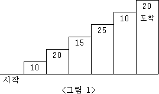
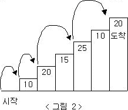

> [문제 출처](https://www.acmicpc.net/problem/2579)


# 1. 문제


계단 오르기 게임은 계단 아래 시작점부터 계단 꼭대기에 위치한 도착점까지 가는 게임이다. <그림 1>과 같이 각각의 계단에는 일정한 점수가 쓰여 있는데 계단을 밟으면 그 계단에 쓰여 있는 점수를 얻게 된다.



예를 들어 <그림 2>와 같이 시작점에서부터 첫 번째, 두 번째, 네 번째, 여섯 번째 계단을 밟아 도착점에 도달하면 총 점수는 10 + 20 + 25 + 20 = 75점이 된다.



계단 오르는 데는 다음과 같은 규칙이 있다.

1. 계단은 한 번에 한 계단씩 또는 두 계단씩 오를 수 있다. 즉, 한 계단을 밟으면서 이어서 다음 계단이나, 다음 다음 계단으로 오를 수 있다.
2. 연속된 세 개의 계단을 모두 밟아서는 안 된다. 단, 시작점은 계단에 포함되지 않는다.
3. 마지막 도착 계단은 반드시 밟아야 한다.

따라서 첫 번째 계단을 밟고 이어 두 번째 계단이나, 세 번째 계단으로 오를 수 있다. 하지만, 첫 번째 계단을 밟고 이어 네 번째 계단으로 올라가거나, 첫 번째, 두 번째, 세 번째 계단을 연속해서 모두 밟을 수는 없다.

각 계단에 쓰여 있는 점수가 주어질 때 이 게임에서 얻을 수 있는 총 점수의 최댓값을 구하는 프로그램을 작성하시오.


**입력**

입력의 첫째 줄에 계단의 개수가 주어진다.

둘째 줄부터 한 줄에 하나씩 제일 아래에 놓인 계단부터 순서대로 각 계단에 쓰여 있는 점수가 주어진다. 계단의 개수는 300이하의 자연수이고, 계단에 쓰여 있는 점수는 10,000이하의 자연수이다.


**출력**

첫째 줄에 계단 오르기 게임에서 얻을 수 있는 총 점수의 최댓값을 출력한다.


**입출력 예**

```python
입력
6
10
20
15
25
10
20

출력 : 75
```


---

# 2. 나의 풀이 


## 풀이 방법


 시작점을 0으로, 마지막을 n으로 하여 연속으로 세 개의 계단을 오르지 않는 경우를 제외하고, 가능한 모든 경우를 나열하면 다음과 같다.


|  n   |                         가능한 경우                          |
| :--: | :----------------------------------------------------------: |
|  1   |                              1                               |
|  2   |                            12 / 2                            |
|  3   |                       ~~123~~, 23 / 13                       |
|  4   |                    ~~234~~, 134 / 124, 24                    |
|  5   |                ~~1345~~, 1245, 245 / 235, 135                |
|  6   |      ~~12456~~, ~~2456~~, 2356, 1356 / 1346, 1246, 246       |
|  7   | ~~23567~~, ~~13567~~, 13467, 12467, 2467 / 12457, 2457, 2357, 1357 |
| ...  |                             ...                              |


 먼저 모든 경우의 수를 나열한다. 오를 수 있는 계단의 수가 1개 혹은 2개이므로, 직전 계단 혹은 전전 계단에서 1칸, 2칸을 오르면 된다. 직전 계단에서 오르는 경우를 `/` 앞에, 전전 계단에서 오르는 경우를 `/` 뒤에 표시했다.


 다만, **제약조건**이 있으므로 *연속으로 세 계단을 오르는 경우* 는 제외해 주어야 한다. 

* 전전 계단에서 오르는 경우는 제약 조건을 *신경 쓸 필요가 없다* . 전전 계단에서 오른다는 것 자체가 두 계단을 오르는 것이므로, 연속으로 한 계단씩 세 번 오르는 경우를 만족할 수 없다. 
* 직전 계단에서 가능한 경우를 보면, 직전 계단에 도달할 때 두 계단을 오른 경우이다. 다시 말하면, 한 칸을 올라 목적지점에 도달하기 위해서는 **세 칸 밑으로 내려가서, 두 칸을 오르고 한 칸을 올라야 한다**는 소리다.


 동적 프로그래밍의 특징 상, 모든 과정에 동일한 점화식이 적용된다. 직전 계단, 혹은 전전 계단까지 오르며 기록한 최대 점수만 알고 있다면 된다.

* 전전 계단에서 오르는 경우는, 전전 계단에서의 최댓값 점수에 목적지 계단의 점수를 더해주면 된다.

* 직전 계단에서 오르는 경우는, 전전전(3계단 전) 계단에서의 최댓값 점수에 직전 계단의 점수를 더하고(그래야 2칸을 올라올 수 있다), 목적지 계단의 점수를 더해주면 된다.

  

 위의 표에서 많은 경우를 나열해 놓았지만, 결국 기록되는 것은 해당 경우의 수들 중 최대의 점수들밖에 없다.


> *시행 착오*
>
>  처음 문제를 풀 때 '점화식'에만 주목했다. 목적지에 오를 수 있는 경로를 직전 계단에서와 전전 계단에서의 경우로 나누어 모두 구한 뒤, 최대 점수를 직접 구했다.
>
>  메모리 초과가 났다. 동적 계획법이 점화식이 중요한 것은 맞지만, 그렇게 노가다로 푸는 것은 아니다. (다시 보니 아주 바보 같은 풀이...)
>
> ```python
> def get_stair_path(n):
>     stairs = {1: ["01"], 2: ["012", "02"]}
>     if n>= 3:
>         for i in range(3, n+1):
>             temp = [stairs[i-1] + stairs[i-2]]
>             temp = [t + str(i) for tmp in temp for t in tmp]
>             temp = [t for t in temp if int(t[-1])-int(t[-3]) != 2]
>             stairs[i] = temp
>     return stairs[n]
> 
> import sys
> 
> n = int(sys.stdin.readline())
> paths = get_stair_path(n)
> scores = [0] + [int(sys.stdin.readline()) for _ in range(n)]
> 
> max_ = 0
> 
> for path in paths:
>     tmp = 0
>     
>     for idx, val in enumerate(path):
>         tmp += scores[int(val)]
>     
>     if tmp > max_:
>         max_ = tmp
> 
> print(max_)
> ```


 

## 풀이 코드

* 변수
  * `stairs` : 주어진 계단의 점수.
  * `max_score` : 만들 수 있는 점수의 최댓값.
* 예외 처리
  * n이 1이거나 2일 때는 바로 그 숫자의 합들을 출력해주면 된다.
  * 점수의 최댓값이 계단을 오르면서 갱신되는 식으로 구현했다. 리스트 인덱스는 0부터 시작하므로, 0번째 칸은 0번 계단으로 간주해 (n+1) 칸의 리스트를 구현했다.

> 29380KB, 64ms.

```python
import sys
s = sys.stdin.readline

n = int(s())
stairs = [0] + [int(s()) for _ in range(n)]

if n == 1 or n == 2:
    print(sum(stairs))
else:
    max_score = [0] * (n + 1)
    max_score[1] = stairs[1]
    max_score[2] = stairs[1] + stairs[2]
    # 2번째 칸의 최댓값은 1칸씩 오를 때.

    for i in range(3, n + 1):
        max_score[i] = max(max_score[i - 2] + stairs[i], max_score[i - 3] + stairs[i - 1] + stairs[i])

    print(max_score[-1])
```


---


# 3. 다른 풀이


[풀이 출처](https://www.acmicpc.net/source/12861748)

```python
import sys
read = lambda: sys.stdin.readline().rstrip()
s1, s2 = 0, 0
a,b,c,d = 0,0,0,0
for _ in range(int(read())):
    k = int(read())
    s1, s2 = s2, k
    a,b,c,d = b,c,d,max(c,b+s1)+s2
print(d)
```


  상위권에 오른 풀이들이 다 이런 방식으로 풀었다.

 리스트를 이용하지 않고, 변수에 저장된 값만 업데이트하는 방식이다.

`s1`, `s2`는 각각 직전 계단의 점수, 현재 계단의 점수를 나타낸다.`a`, `b`, `c`, `d`가 각각 무엇을 의미하는지는 명확하지 않다. code inspection을 더 진행해 이해한 후 과정을 기술한다.

 


---

# 4. 배운 점, 더 생각해 볼 점


*  No No가다.